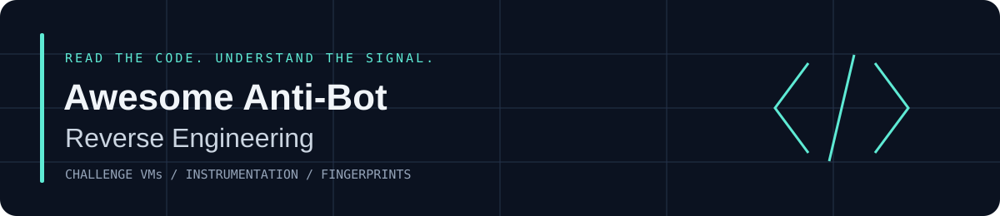

# Awesome Anti-Bot Reverse Engineering 

Selected **reverse-engineering case studies and tools for browser anti-bot systems**: JavaScript deobfuscation, virtual machines, sensor and signing logic, anti-debugging, browser internals and protocol analysis.

**Start with the implementation. Trace the mechanism. Keep the evidence and limits visible.**

[Tiếng Việt](README.vi.md) · [Curation policy](CURATION.md) · [Source atlas](SOURCES.md) · [Evidence ledger](data/resources.json) · [Latest review](reports/2026-09-12-re-focus.md)

## Contents

- [Akamai sensor and obfuscation](#akamai-sensor-and-obfuscation)
- [Imperva devirtualization](#imperva-devirtualization)
- [AWS WAF deobfuscation](#aws-waf-deobfuscation)
- [Application signing and challenge VMs](#application-signing-and-challenge-vms)
- [AST and intermediate representations](#ast-and-intermediate-representations)
- [RE instrumentation](#re-instrumentation)
- [Supporting references](#supporting-references)
- [Research gaps and pending cases](#research-gaps-and-pending-cases)
- [Maintenance](#maintenance)

## Reading guide

| RE question | Start with |
| --- | --- |
| How is a sensor assembled? | Akamai BMP for static analysis; XP1M for backward provenance. |
| How do I study stateful obfuscation? | The Russian Akamai AST-interpreter article. |
| How can VM bytecode become readable logic? | Reese84 combinator lifting; marketplace register-VM and Trip.com stack-VM traces. |
| How do I inspect an obfuscated signing flow? | Douyin's captured SDK analysis and browser instrumentation tools. |
| What supports transport and detection experiments? | The separate [TLS/HTTP and measurement references](SUPPORTING.md). |

**Snapshot** means a study of the stated artifact/version, including older implementations. Its method can remain useful after a vendor changes its code. **Source-reviewed** means relevant primary material was read; **code-reviewed** names the exact source portions inspected in the ledger. Neither means a live target test. No runtime-tested claim is assigned.

## Akamai sensor and obfuscation

- [Akamai BMP sensor teardown](https://github.com/arisune1337/akamai-bmp-research) - Dissects an Akamai BMP sensor through string recovery, bytecode disassembly and sensor-data structure analysis. **en · snapshot study · code-reviewed**. Single sample; unknown opcodes and incomplete decoding.
- [Akamai XP1M: provenance slicing](https://github.com/OneWinged-ShunKaido/akamai-xp1m-teardown) - Uses backward provenance traces to connect a divergent sensor character to DOM property checks across VM layers. **en · snapshot study · source-reviewed**. Detailed trace excerpts; engine and raw captures are unavailable.
- [Akamai Bot Manager 2.0: AST interpretation](https://habr.com/ru/articles/720588/) - Builds a small AST interpreter to inspect obfuscated Akamai JavaScript and recover state-dependent strings. **ru · snapshot study · source-reviewed**. 2023 case; interpreter semantics and browser environment are partial.

## Imperva devirtualization

- [decapsula: Imperva Reese84 devirtualization](https://github.com/recurism/decapsula) - Lifts Reese84 bytecode into triplets, interprets combinator expressions and folds the result into readable JavaScript. **en · snapshot study · code-reviewed**. Lossy output; unknown values and bounded reductions remain.

## AWS WAF deobfuscation

- [AWS WAF challenge AST cleanup](https://github.com/juanfrilla/awswaf_ast) - Shows a staged Babel pipeline for simplifying AWS WAF challenge JavaScript and inspecting intermediate transformations. **en · snapshot study · code-reviewed**. Raw input absent; driver loads 10 transforms versus 11 in README.

## Application signing and challenge VMs

- [Douyin a_bogus analysis](https://github.com/hanzheng1954/douyin-abogus-analysis) - Maps a_bogus signing to a stack VM using table extraction, disassembly and opcode traces. **zh-Hans · snapshot study · source-reviewed**. Author's 2026-08-30 captured version; no live target validation or current signature-success claim.
- [Marketplace JSVMP: tracing a register VM](https://github.com/juanfrilla/FamousRussianMarketplace) - Explains AST cleanup and VM-handler tracing for reconstructing the fingerprint logic of an anonymized marketplace. **en · snapshot study · code-reviewed**. Version-specific register VM; live behavior not tested.
- [Trip.com Phantom-Token VM analysis](https://github.com/juanfrilla/trip_vm_reversed) - Documents signer localization, browser-environment discovery and VM-handler traces for understanding Phantom-Token logic. **en · snapshot study · code-reviewed**. Instrumentation study; trace logging is not a general taint engine.

## AST and intermediate representations

- [webcrack](https://github.com/j4k0xb/webcrack) - Deobfuscates JavaScript and unpacks webpack/browserify output with documented CLI and API usage. **en · RE tool · source-reviewed**. Supported transforms and Node/V8 dependencies bound what it can analyze.
- [JSIR](https://github.com/google/jsir) - MLIR-based JavaScript representation for dataflow analysis and source-to-source transformation. **en · RE tool · source-reviewed**. Building LLVM/Bazel dependencies can be substantial; this review did not build the project.

## RE instrumentation

- [Firefox-Reverse](https://github.com/WhiteNightShadow/firefox-reverse) - Documents SpiderMonkey/Gecko hooks for observing request-signing logic, JSVMP execution and WASM boundaries. **zh-Hans · RE tool · source-reviewed**. Experimental fork; the claimed instrumentation and current builds have not been executed in this review.
- [Camoufox Reverse MCP](https://github.com/WhiteNightShadow/camoufox-reverse-mcp) - Documents browser RE instrumentation and local validation cases for hooks, source capture and signer comparisons. **zh-Hans · RE tool · source-reviewed**. Maintainer-reported validation; hooks can alter observations.

## Supporting references

[Supporting references](SUPPORTING.md) contains browser debugging protocols, TLS/HTTP fingerprints, detection and measurement, CAPTCHA design, accessibility, datasets and service documentation. These help investigate systems; service integration guides do not substitute for implementation RE.

## Research gaps and pending cases

Cloudflare/Turnstile VM analysis, DataDome, Kasada, PerimeterX/HUMAN, hCaptcha internals and mobile/WebView anti-bot RE need further primary-source review. A named vendor is a research lane, not evidence of coverage.

The [watchlist](WATCHLIST.md) records Turnstile's explicitly obsolete implementation, a fork guide with unverified claims, Cloudflare deobfuscator documentation gaps, and blocked Nike-VM article reads. The [original catalogue](catalog/LEGACY.md) remains available; its old dates and operational descriptions are not newly certified. [Historical context](catalog/HISTORICAL.md) retains earlier research decisions.

## Maintenance

- Acceptance requires ≥85/100, primary evidence and all [mandatory gates](CURATION.md#mandatory-gates). A core entry additionally names the RE target, method and inspected artifact; cases specify their sample/version.
- Prefer new research within 365 days, while retaining qualified snapshot studies. Never refresh a source date merely because it was read or committed today.
- Explore [16 language lanes and 33 source channels](SOURCES.md), including original blogs, forums, papers, talks and code. Current accepted source languages are en, ru and zh-Hans; other lanes remain coverage goals.
- Recurring discovery prioritizes actual RE methods and cases. [Automation runbook](docs/AUTOMATION.md) separates research from link and catalogue checks. Actions startup remains unresolved in the [deployment report](reports/2026-09-12.md); a configured cron is not evidence of successful execution.
- [Contributions](CONTRIBUTING.md) need a concrete learning benefit and limitations. Author claims, source inspection and our own runtime tests remain distinct.

This AI-assisted catalogue does not claim acceptance into the upstream Awesome index. Repository text is [CC0](LICENSE); linked resources retain their own licenses.
